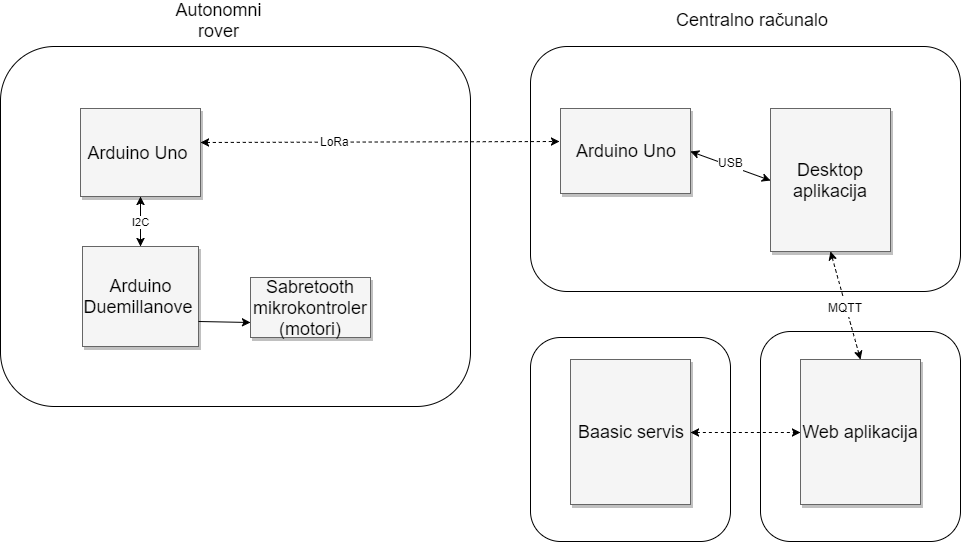

# Udaljeno upravljanje robotskim sustavom baziranom na Arduino mikrokontroleru i LoRa bežičnim modulima

# 1. Uvod
Tijekom trajanja prakse ostvaren je robotski sustav kojim se može upravljati udaljeno, preko web aplikacije. Kao baza sustava poslužio je Lynxmotion Rover Kit, koji uključuje tijelo robota s motorima, odgovarajući upravljač za motore te dodatni Arduino mikrokontroler za upravljanje sustavom. Daljnom nadogradnjom, robot je preko bežične veze (ostvarene LoRa modulima) povezan sa centralnim računalom, koje prenosi očitanja robotskih senzora na web poslužitelj. Na isti način se i naredbe za kretanje i upravljanje prenose od sučelja web aplikacije do robotskog sustava.

# 2. Arhitektura sustava
Tijekom rada na sustavu podjednaki naglasak bio je na povezivanju i integraciji sklopovlja i njihovom napajanju, te na razvoju desktop i web aplikacija i odgovarajućih upravljačkih programa za mikrokontrolere. 
Općenito gledano, sustav se sastoji od autonomnog robota, centralnog računala povezanog na Internet i na Arduino mikrokontroler, te web aplikacije postavljene na poslužitelj.   

 

## 2.1. Sklopovlje i spajanje sustava
Na strani centralnog računala, spajanje se svodi na povezivanje Arduino mikrokontrolera s LoRa Shieldom, i zatim preko USB-a na stolno računalo.
Na robotskoj strani, kontrolni Arduino se treba spojiti s LoRa Shield modulom, te potom povezati s Arduino mikrokontrolerom zaduženom za motore preko analog pinova 4 i 5, te GND pina. Ovakva veza omogućuje njihovu međusobnu komunikaciju pomoću I2C protokola, koji je programski ostvaren u Arduino biblioteci "Wire". Kontrolni Arduino još je potrebo spojiti s GPS modulom, tako da se RX i TX izlazi GPS-a povežu na digitalne pinove 7 i 8 na Arduinu, te također VCC i GND na odgovarajuće pinove Arduina, tj. 5V i GND.   
Konačno, na Arduinu zaduženom za motore, potrebno je spojiti pinove Sabretooth kontrolera na pinove 3 i 4, te infracrvene senzore na analog pinove 2,3 i 4.

# 3. Programska potpora
Programska potpora ostvarena je na više razina. Za Arduino miktrokontrolere razvijena su tri odgovarajuća upravljačka programa; centralno računalo ima svoju desktop aplikaciju koja posreduje između mikrokontrolera i web aplikacije; te konačno web aplikacija kojom se može upravljati robotom i koja prikuplja očitanja senzora na robotu. 
## 3.1. Upravljački programi za Arduino mikrokontrolere
Na robotskoj strani, Arduino zadužen za motore upravljan je programom koji preko I2C veze prima naredbe od upravljačkog Arduina na robotu. Na temelju naredbe se tada na odgovarajući način pokreću motori, koristeći funkcije biblioteke "Servo". Također, u glavnoj programskoj petlji se stalno očitavaju stanja infracrvenih senzora koji predstavljaju blizinu prepreke. Ako je ona prevelika, robot će se zaustaviti kako ne bi došlo do kolizije.
Upravljački mikrokontroler na robotu po pokretanju uspostavlja bežičnu vezu preko LoRa modula te I2C vezu sa Arduinom zaduženom za motore. U glavnoj petlji provjerava se da li je stigla nova poruka preko uspostavljene LoRa veze; ako je, ona se čita te se iz nje izvlači nova naredba koja se po potrebi prosljeđuje preko I2C drugom mikrokontroleru. Također, u petlji se periodički očitava stanje GPS modula. Ako je dostupno novo očitanje GPS-a, ono se pakira u JSON format te šalje preko LoRa veze na Arduino kontroler spojen na centralno računalo.
Na strani centralnog računala također je spojen Arduino mikrokontroler koji je nadograđen LoRa modulom, i USB-om spojen sa stolnim računalom na kojem je aktivna odgovarajuća desktop aplikacija. U upravljačkoj petlji Arduina provjerava se pristigla komunikacija preko ove dvije veze; dobivene LoRa poruke predstavljaju nova očitanja GPS-a, koja se odmah prosljeđuju desktop aplikaciji preko USB-a. Poruke dobivene preko serijske USB veze predstavljaju nove naredbe za robota, te se prosljeđuju preko LoRa poruke na robotsku stranu.
## 3.2. Desktop aplikacija
Desktop aplikacija ostvarena je pomoću WinForms razvojne paradigme, u VS2015 razvojnom okruženju korištenjem programskog jezika C#. Preko grafičkog sučelja, moguće je aktivirati serijsku USB vezu sa Arduino miktrokontrolerom, te vezu sa MQTT poslužiteljem preko kojeg se odvija komunikacija s web aplikacijom. Nakon aktivacije, sve poruke pristigle preko MQTT-a se automatski tumače i prosljeđuju kao naredbe preko USB veze na mikrokontroler. Po ažuriranju GPS lokacije, aplikacija periodički preko MQTT protokola šalje očitanje GPS-a na web poslužitelj.
## 3.3. Web aplikacija
Web aplikacija ostvarena je pomoću Angular2 razvojnih alata, te integrira module za pristupanje servisu Baasic. Na zahtjev, aplikacija preko MQTT protokola komunicira s desktop aplikacijom, šaljući naredbe za pokretanje i primajući GPS očitanja. Očitanja se automatski prosljeđuju na servis Baasic u DynamicResource obliku. Također, iz svakog GPS  očitanja izvlači se lokacija koja se potom prikazuje na Google karti na sučelju aplikacije.

# 4. Izazovi i daljnji rad
Tijekom izrade sustava javilo se nekoliko problema i izazova koje je trebalo riješiti. 
 Za ostvarenje potpune autonomije robota, bilo je  potrebno osigurati odgovarajuće napajanje. Konačno odabrano rješenje je uključivalo napajanje Arduino Duemillanove i Sabretooth mikrokontrolera pomoću 12V baterije, dok je kontrolni Arduino Uno na robotu napajan 5V power bankom. Napajanje cijelog sustava jednom baterijom nije bilo moguće zbog nekompatibilnosti naponskih razina, odnosno nemogućnosti pravilne regulacije napona baterije.
Također, bilo je potrebno ostvariti što veći domet bežične komunikacije između autonomnog robota i centralnog računala. Za ostvarenje bežične komunikacije koristio se LoRaWAN protokol, namijenjen primarno za IoT mreže, te prilagođen za visok domet i nisku potrošnju energije. Za povećanje dometa komunikacije, LoRa module je bilo potrebno nadograditi većim antenama (200mm), te je u konačnici ostvaren domet komunikacije od preko 4.5km.    
Daljnji rad na sustavu mogao bi se usredotočiti na povećanje kapaciteta autonomnog robota, primjerice dodatkom kamere koja bi pomogla kod navigacije i detekcije prepreka, ili čak praćenja objekata (PixyCam). 

# Dodatak
## A) Popis komponenti:
- 2x Arduino Uno
- 2x Dragino LoRa Shield
- 2x antena 868MHz, 200mm
- GPS modul (GY-GPS6MV2)
- Powerocks 5V power bank
- Nimh battery pack 12V
- Lynxmotion A4WD1 Autonomous Rover Kit (http://www.robotshop.com/en/lynxmotion-a4wd1-autonomous-rover-kit-botboarduino.html)   

